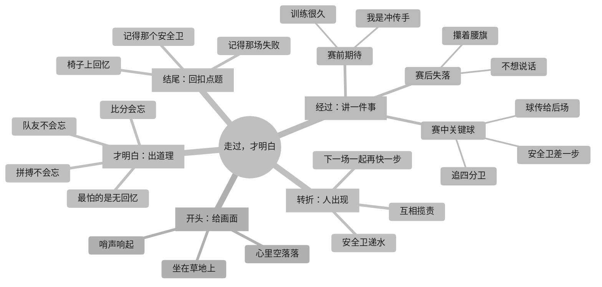

# 《走过，才明白》作文大纲 · 思维导图

> **作者**：嘟嘟  
> **题目**：走过，才明白  
> **素材**：腰旗橄榄球比赛失利经历  
> **主题**：最可怕的不是失败，而是没有拼搏的勇气和一起奋斗的人

---

## 一、Mermaid 思维导图



---

## 二、文字版思维导图（备用 · 高对比）

```
《走过，才明白》
│
├─ 🟦 开头：给画面
│   ├─ 哨声响起
│   ├─ 坐在草地上
│   └─ 心里空落落
│
├─ 🟩 经过：讲一件事
│   ├─ 赛前期待
│   │   ├─ 训练很久
│   │   └─ 我是冲传手
│   ├─ 赛中关键球
│   │   ├─ 追四分卫
│   │   ├─ 球传给后场
│   │   └─ 安全卫差一步
│   └─ 赛后失落
│       ├─ 攥着腰旗
│       └─ 不想说话
│
├─ 🟨 转折：人出现
│   ├─ 安全卫递水
│   ├─ 互相揽责
│   └─ 下一场一起再快一步
│
├─ 🟪 才明白：出道理
│   ├─ 比分会忘
│   ├─ 拼搏不会忘
│   ├─ 队友不会忘
│   └─ 最怕的是无回忆
│
└─ 🟥 结尾：回扣点题
    ├─ 椅子上回忆
    ├─ 记得那场失败
    └─ 记得那个安全卫
```

---

## 三、写作思路速查

| 段落 | 功能 | 一句话提示 |
|------|------|------------|
| 开头 | 给画面 | 让读者看见你坐在草地上 |
| 经过 | 讲一件事 | 只写一次关键防守 |
| 转折 | 人出现 | 安全卫递水，说一句话 |
| 才明白 | 出道理 | 从这件事里长出来的感悟 |
| 结尾 | 回扣点题 | 开头坐草地，结尾坐椅子 |

---

**约定**：以后嘟嘟让书童帮忙写大纲，书童统一用思维导图格式输出。
